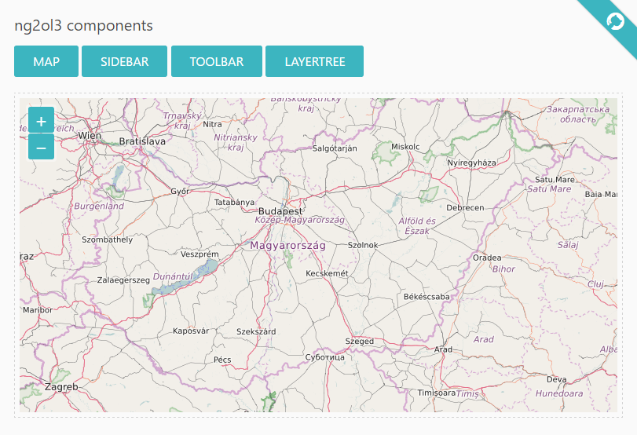

# ng2ol3
> A combination of <b>Angular2 & OpenLayers3</b> using <i>TypeScript, RxJS & SCSS (Bourbon) </i> for creating customizable, modern web maps

## Install
[Node.js with npm](https://nodejs.org/en/download/) is required. The minimum version of Node.js is 4.x.x, the minimum version of npm is 3.x.x. You can check the versions with the following commands: ```node -v``` and ```npm -v```. About installing and/or upgrading Node.js & npm [follow this tutorial](https://docs.npmjs.com/getting-started/installing-node).

Navigate to ng2ol3's main directory and run ```npm install``` to download all dependencies.

## Live example
An online example can be viewed [here](http://188.166.116.137/ng2ol3).

## Usage
1. If you wish to see the built-in demos or modify the source files, simply run ```npm start``` to load the demo page on ```localhost:3000```. This starts Node.js and watches for file changes until you shut it down. For example, if you change a .ts, .scss or .html file, Node.js instantly transpiles .ts into .js, .scss into .css, and the page is reloaded by itself.
2. If you would like to use ng2ol3 as an npm library in your Angular2 project, you can also do that since [ng2ol3 is on npm](https://www.npmjs.com/package/ng2ol3) as well. A simple example can be found in the ```ng2ol3-examples.zip``` file. All you have to do is unpack it somewhere on your machine, run ```npm install``` and then ```npm start```.

## Present & Future
This is just a basic demo with two examples: simple demo and sidebar demo. In the near future I intend to add/extend other widgets such as header, layertree, featureinfo panel, printing etc. RxJS is not yet implemented. More examples will arrive as soon as the project becomes smarter.
Ng2ol3 has recently been updated to work with Angular2 RC6 and TypeScript2.



## Author
```ng2ol3``` was created by [Gergely Padányi-Gulyás](http://www.gpadanyig.com)


