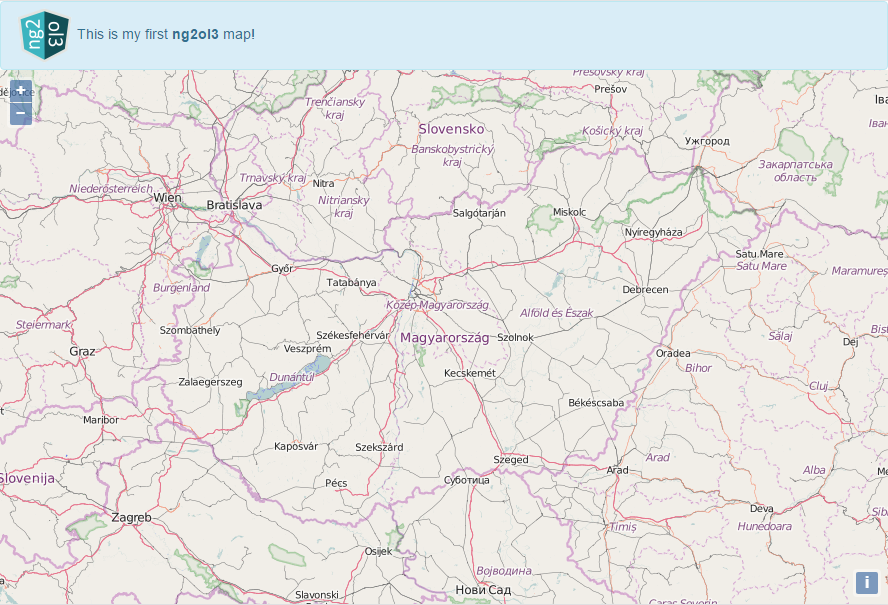

# ng2ol3
> A combination of <b>Angular2 & OpenLayers3</b> using <i>TypeScript, RxJS, SCSS & Bootstrap</i> for creating customizable, modern web maps

## Install
[Node.js with npm](https://nodejs.org/en/download/) is required. The minimum version of Node.js is 4.x.x, the minimum version of npm is 3.x.x. You can check the versions with the following commands: ```node -v``` and ```npm -v```. It is possible that the Node.js is the correct version but npm is only v2.x.x (this can happen if you use the current LTS installer). In this case install <b>npm3</b> like this: ```npm install npm3``` and from now on <b>use npm3 instead of npm</b> (e.g. if you see ```npm install```, type ```npm3 install``` instead).

First run ```npm install``` and ```npm run typings install``` to download all dependencies. It is highly recommended to install typescript and node-sass system-wide: ```npm install -g typescript``` and ```npm install -g node-sass```.

As an editor I recommend [Atom](https://atom.io/) with the following packages: <i><b>atom-typescript, sass-autocompile,</b> color-picker, emmet, file-icons, git-plus, keyboard-localization, minimap, pigments, project-manager, atom-beautify, docblockr, markdown-preview-enhanced</i>.

## Usage
Simply Run ```npm start``` to load the sample page.



## Present & Future
This is just a basic demo app at the moment. In the near future I intend to add customizable widgets such as layertree, featureinfo panel, printing etc. RxJS is not yet implemented. More examples will arrive as soon as the project becomes smarter.

## Author
```ng2ol3``` was created by [Gergely Padányi-Gulyás](http://www.gpadanyig.com)


