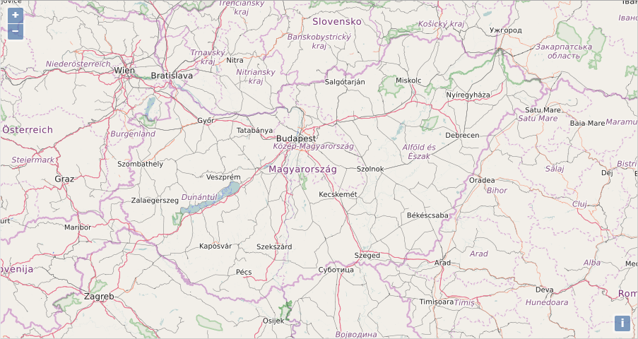

# ng2ol3
> A combination of <b>Angular2 & OpenLayers3</b> using <i>TypeScript, RxJS & SCSS (Bourbon) </i> for creating customizable, modern web maps

## Install
[Node.js with npm](https://nodejs.org/en/download/) is required. The minimum version of Node.js is 4.x.x, the minimum version of npm is 3.x.x. You can check the versions with the following commands: ```node -v``` and ```npm -v```. It is possible that the Node.js is the correct version but npm is only v2.x.x (this can happen if you use the current LTS installer). In this case install <b>npm3</b> like this: ```npm install npm3``` and from now on <b>use npm3 instead of npm</b> (e.g. if you see ```npm install```, type ```npm3 install``` instead).

Run ```npm install``` and ```npm run typings install``` to download all dependencies.

As a text editor I recommend the free [Visual Studio Code](https://www.visualstudio.com/en-us/products/code-vs.aspx). (Angular2 is developed with it!)

## Usage
Simply run ```npm start``` to load a sample page on ```localhost:3000```. This starts Node.js and watches for file changes until you shut it down. For example, if you change a .ts, .scss or .html file, Node.js instantly translates .ts into .js, .scss into .css, and the page is reloaded by itself.



## Present & Future
This is just a basic demo app at the moment with a simple OL3 map with one OpenStreetMap layer. In the near future I intend to add other widgets such as header, sidebar, layertree, featureinfo panel, printing etc. RxJS is not yet implemented. More examples will arrive as soon as the project becomes smarter.
Ng2ol3 has recently been to Angular2 RC6.

## Author
```ng2ol3``` was created by [Gergely Padányi-Gulyás](http://www.gpadanyig.com)


